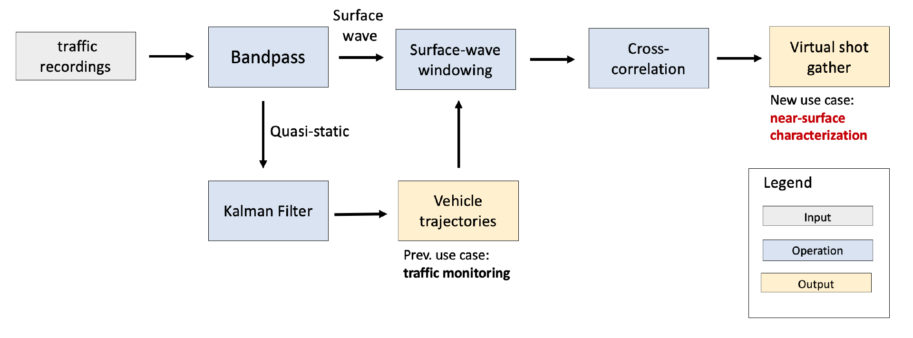

# Automated and Continuous Near-surface characterization using a DAS-based Vehicle Tracking Method

Virtual shot gathers with one car signal | Virtual shot gathers with 236 car signals   
:-------------------------:|:-------------------------:
  |  

Disperson image with one car signal | Disperson image with 236 car signals   
:-------------------------:|:-------------------------:
  |  

This is the repository for the following paper. If you use this implementation, please cite our papers:

>* TODO

[[paper]]()

and

>* Liu, J., Yuan, S., Dong, Y., Biondi, B., & Noh, H. Y. (2023). TelecomTM: A Fine-Grained and Ubiquitous Traffic Monitoring System Using Pre-Existing Telecommunication Fiber-Optic Cables as Sensors. arXiv preprint arXiv:2305.03172.

[[paper]](https://arxiv.org/abs/2305.03172)

### Description



This study proposes a novel method for detecting spatial subsurface heterogeneity and rain-induced soil saturation changes in the San Francisco Bay Area. Our approach utilizes vehicles as cost-effective surface-wave sources that excite wavefield recorded by a roadside Distributed Acoustic Sensing (DAS) array. Leveraging a Kalman filter vehicle-tracking algorithm, we can automatically track hundreds of vehicles each day, allowing us to extract space-time windows of high-quality surface waves. By constructing highly accurate virtual shot gathers from these waves, we can perform time-lapse surface-wave analyses with high temporal and spatial resolutions.

### Code Usage
```
git clone https://github.com/TODO

```
- Run the demo example with
```
jupyter notebook demo.ipynb
```
### Contact
Feel free to send any questions to:
- [Siyuan Yuan](mailto:syyuan@stanford.edu)
